<!--
  ────────────────────────────────────────────────────────────────────────────
  GUILLAUME CLIN — PROFILE README
  Theme: Blueprint / Civil Construction
  Palette: #0B2545 (navy) · #8ECAE6 (cyan) · #FFB703 (drafting amber) · #F2F8FF (paper)
  ────────────────────────────────────────────────────────────────────────────
-->
## `§ 01 — Identification`

👨‍💻 **Guillaume Clin**  
🏗️ **Federated Digital Twin** · Civil Construction  
📐 **Product Management** · Cloud · Geospatial Intelligence  
🛰️ **Trimble** — building the Digital Site Management  
🧠 **Launched cloud-based intelligence** for civil construction workflows  
[▰▰▰▰▰▰▰▰▰▰▰▰▰▰▰▰▰░░░] 87% caffeinated  
🎙️ **Public talks & content** on digital twins for the built world — see <a href="https://www.youtube.com/@Guillaume.Clin_Trimble"><b>YouTube</b></a>  
🤝 **Shipped the federated layer** that lets surveying data update design models and machine guidance in the same workday — closing the design ↔ field loop end-to-end.  

  

  

  
  
  

> **TL;DR —** I build the cloud tools that move dirt, pour concrete, and tie the design model to the bulldozer.
> Then I make sure the data that comes back makes the *next* project smarter.

---

## `§ 02 — THE FEDERATED DIGITAL TWIN`

Civil construction and surveying have lived in silos for decades. The **design twin** doesn't talk to the **construction twin**, which doesn't talk to the **asset twin** — so every handoff loses fidelity, and the jobsite ends up rediscovering reality with a tape measure.

A **Federated Digital Twin** changes that. Instead of one monolithic model, it's a mesh of specialized twins that share a common semantic layer and a single source of geospatial truth:

  

### Why this matters in **surveying + civil construction**

- **Surveying is the anchor.** Every twin is only as good as its coordinates. Federation lets a survey crew's GNSS shot in the morning update the design model by lunch and the machine guidance file by the afternoon.
- **Constructibility becomes computable.** Design clashes, earthwork volumes, sequencing risks — all queryable across twins instead of trapped in PDFs.
- **The field finally writes back.** Machines, drones, and crews produce telemetry; the federated twin turns that into the as-built without anyone re-keying anything.
- **Sustainability gets a denominator.** You can't decarbonize what you can't measure — federated data finally puts emissions on the same axis as productivity.

The goal isn't "more data." It's **fewer surprises**, **faster decisions**, and an **as-built that's actually accurate** on day one of operations.

### 📰 Featured Writing

<!-- LINKEDIN-CARDS-START -->
<a href="https://www.linkedin.com/in/guillaume-clin/recent-activity/articles/" target="_blank" rel="noopener noreferrer">
  <picture>
    <source media="(prefers-color-scheme: dark)" srcset="./assets/linkedin-cards-dark.svg" />
    
  </picture>
</a>
<!-- LINKEDIN-CARDS-END -->

  <a href="https://www.linkedin.com/in/guillaume-clin/recent-activity/articles/">→ See all articles on LinkedIn</a>

### 🎬 Latest on YouTube

<!-- BEGIN YOUTUBE-CARDS -->

<!-- END YOUTUBE-CARDS -->

  <a href="https://www.youtube.com/@Guillaume.Clin_Trimble">→ See all videos on YouTube</a>

  
  
  
  
  
  
  

---

## `§ 04 — CONTRIBUTION METRICS`

  

  

---

## `§ 05 — NOW PLAYING`

  

↳ Soundtrack to drafting infrastructure that thinks. Setup steps in <code>SETUP.md</code>.

---

  
  

---

  <em>"We don't pour concrete to build twins. We build twins so the concrete gets poured exactly right."</em>

  

